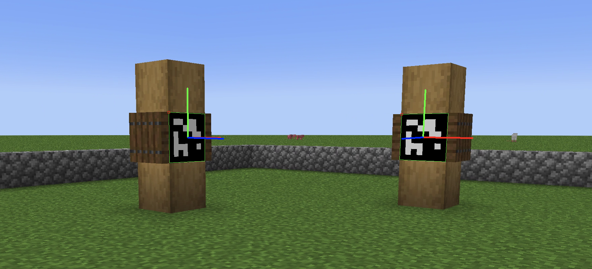

# Monte-Carlo-Localization
This project focuses on pose estimation in the game Minecraft using visual cues in the form of Arauco markers. The pose of the player relative to the markers is estimated using Computer Vision techniques. This information is then used in a Particle Filter to infer the player's pose in the global frame.

  

